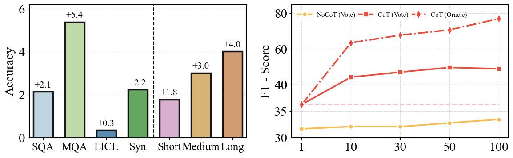

<p align="center">
    
<p>

# 📖 Chain-of-Thought Matters: Improving Long-Context Language Models with Reasoning Path Supervision

<p align="center">
    🤗 <a href="https://huggingface.co/collections/Lemon123prog/longreps-67c54f91b940623729f7ba9e" target="_blank">HF Repo</a> • 📃 <a href="https://arxiv.org/pdf/2502.20790" target="_blank">Paper</a>
</p>
**LongRePS** tackles quality bottlenecks in CoT reasoning for extended contexts by integrating process supervision. As shown in the figure, we have discovered that in complex task scenarios, using the chain of thought always enables the model performance to achieve a universal gain. Furthermore, we figure out that while vanilla CoT improves with context length, self-sampled reasoning paths exhibit significant inconsistency and hallucination risks, especially in multi-hop QA and complex scenarios.

The framework operates in two phases: (1) **​Self-sampling**​ generates diverse CoT candidates to capture reasoning variability, and (2) **​Context-aware assessment**​ enforces answer correctness, grounding via text matching, and intrinsic consistency via LLM-based scoring.

Evaluations on long-context tasks show LongRePS achieves 13.6/3.8-point gains on MuSiQue (LLaMA/Qwen) and cross-task robustness, outperforming outcome supervision. The results validate process supervision as pivotal for scalable long-context reasoning, with open-source code enabling community adoption.
***

***
| ​**Model**​               | ​**MuSiQue**​ | ​**QAs-LBV1**​           |                |           |          | ​**QAs-LBV2**​ |          | ​**Avg.**​ |
|-------------------------|------------:|------------------------|----------------|-----------|----------|--------------|----------|---------:|
|                         |             | ​**HPQA**​               | ​**MFQA**​       | ​**Qasper**| ​**2WMQA**| ​**SQA**​      | ​**MQA**​  |          |
|-------------------------|-------------|------------------------|----------------|-----------|----------|--------------|----------|---------:|
| ​**LLaMA-3.1-8B-Instruct**​ | 45.3        | 57.3                   | 53.8           | 42.9      | 64.0     | 29.3         | 32.2     | 46.4     |
| _LLaMA-3.1-8B-Base_       | 12.6        | 21.2                   | 29.9           | 13.4      | 19.9     | 1.2          | 1.7      | 14.3     |
| ↳ w/ Outcome Supervision | 47.0        | 50.0                   | 44.4           | 32.1      | 37.1     | 17.1         | 14.8     | 34.7     |
| ↳ ​**w/ LongRePS**​         | ​**60.6**<br>(+13.6↑) | ​**57.9**<br>(+7.9↑) | ​**53.8**<br>(+9.4↑) | ​**36.0**<br>(+3.9↑) | ​**50.5**<br>(+13.4↑) | ​**28.1**<br>(+11.0↑) | ​**31.3**<br>(+16.5↑) | ​**44.0**<br>(+9.3↑) |
|-------------------------|-------------|------------------------|----------------|-----------|----------|--------------|----------|---------:|
| ​**Qwen-2.5-7B-Instruct**​  | 39.4        | 57.5                   | 48.7           | 43.0      | 54.2     | 34.2         | 33.0     | 44.3     |
| _Qwen-2.5-7B-Base_        | 23.8        | 43.8                   | 46.2           | 29.9      | 28.2     | 30.5         | 32.2     | 33.5     |
| ↳ w/ Outcome Supervision | 49.2        | 58.1                   | 43.2           | 29.7      | 41.2     | 20.7         | 17.4     | 37.1     |
| ↳ ​**w/ LongRePS**​         | ​**53.0**<br>(+3.8↑) | 57.0<br>(-1.1↓)     | ​**45.6**<br>(+2.4↑) | ​**38.4**<br>(+8.7↑) | ​**58.1**<br>(+16.9↑) | ​**30.5**<br>(+9.8↑) | ​**33.9**<br>(+16.5↑) | ​**45.2**<br>(+8.1↑) |
|-------------------------|-------------|------------------------|----------------|-----------|----------|--------------|----------|---------:|
| GPT-4o-mini              | 46.3        | 56.1                   | 50.2           | 38.7      | 64.0     | 34.2         | 34.2     | 46.2     |
| GPT-4o                   | 55.8        | 65.8                   | 54.8           | 45.4      | 74.8     | 46.0         | 47.2     | 55.7     |

## 🔍 List of Contents
- [⚙️ How to Prepare Data for Training](#how-to-Prepare-Data-for-Training)
- [🖥️ How to Prepare Data for Evaluating](#how-to-Prepare-Data-for-Evaluating)
- [🍧 Training](#training)
- [📊 Evaluation](#evaluation)
- [📄 Acknowledgement](#acknowledgement)

<a name="how-to-Prepare-Data-for-Training"></a>

## ⚙️ How to Prepare Data for Training

**Llama-3.1-8B**:
```python
from datasets import load_dataset
import jsonlines
model="Llama-3.1-8B"
dataset = load_dataset("Lemon123prog/Llama-3.1-8B-LongRePS")
warmup_data=dataset['warmup'].to_list()
orm_data=dataset['train_orm'].to_list()
prm_data=dataset['train_prm'].to_list()

with jsonlines.open(f"/data/{model}_warmup.jsonl", 'w') as writer:
    writer.write_all(warmup_data)

with jsonlines.open(f"/data/{model}_orm.jsonl", 'w') as writer:
    writer.write_all(orm_data)

with jsonlines.open(f"/data/{model}_prm.jsonl", 'w') as writer:
    writer.write_all(prm_data)
```

**Qwen-2.5-7B**:
```python
from datasets import load_dataset
import jsonlines
model="Qwen-2.5-7B"
dataset = load_dataset("Lemon123prog/Qwen-2.5-7B-LongRePS")
warmup_data=dataset['warmup'].to_list()
orm_data=dataset['train_orm'].to_list()
prm_data=dataset['train_prm'].to_list()

with jsonlines.open(f"/data/{model}_warmup.jsonl", 'w') as writer:
    writer.write_all(warmup_data)

with jsonlines.open(f"/data/{model}_orm.jsonl", 'w') as writer:
    writer.write_all(orm_data)

with jsonlines.open(f"/data/{model}_prm.jsonl", 'w') as writer:
    writer.write_all(prm_data)
```

Or you can simply run [preprocess.py](preprocess.py)
```bash
python preprocess_train.py
```

<a name="how-to-Prepare-Data-for-Evaluating"></a>

## 🖥️ How to Prepare Data for Evaluating

```bash
bash scripts/preprocess_lb.sh
```
Then you will obtain the processed evaluation data in the **dataset** directory.

<a name="training"></a>

## 🍧 Training

### Download base models

```python
from huggingface_hub import snapshot_download
from pathlib import Path
repo_id ="Qwen/Qwen2.5-7B"
root_dir = Path("Your own path for Qwen")
snapshot_download(repo_id=repo_id,local_dir=root_dir/repo_id,repo_type="model")

repo_id ="meta-llama/Llama-3.1-8B"
root_dir = Path("Your own path for Llama")
snapshot_download(repo_id=repo_id,local_dir=root_dir/repo_id,repo_type="model")
```

Set **Model_Path** in the scripts before training.

### Warm Up Stage

**Llama-3.1-8B**
```bash
bash scripts/llama_warmup.sh
```

**Qwen-2.5-7B**
```bash
bash scripts/qwen_warmup.sh
```

### Sample Data and Fine-tune Models

Set **Model-Name** & **Model-Path** & **File-Name** in the scripts before sampling.
```bash
cd evaltoolkits
bash loop_sample.sh
```

After the sampling process, you can use [filter_data.py](evaltoolkits/filter_data.py) to launch the filtering framework.

```bash
cd evaltoolkits
python filter_data.py \
--path_to_src_file [Sampling Data] \
--path_to_stage1_file [Output Data Path]
```

You can modify [dataset_info.json](data/dataset_info.json) to enable the added **filtered dataset** to be included in the file list.

Finally, by set the **warm-up model path** and **datset_name** in the scripts, you can launch the fine-tuning process.

**Llama-3.1-8B**
```bash
bash scripts/llama_sft.sh
```

**Qwen-2.5-7B**
```bash
bash scripts/qwen_sft.sh
```

<a name="evaluation"></a>

## 📊 Evaluation

**LongBench v1**
```bash
cd evaltoolkits
bash launch_lbv1.sh
```

**LongBench v2**
```bash
cd evaltoolkits
bash launch_lbv2.sh
```

Note: Set **model_path** and **mode** to the desired target model.

<a name="acknowledgement"></a>

## 📄 Acknowledgement
We are deeply thankful for the following projects that serve as the foundation for LongRePS:

* [**SEALONG**](https://github.com/SihengLi99/SEALONG)
* [**LongBench**](https://github.com/THUDM/LongBench)
* [**LLaMA-Factory**](https://github.com/hiyouga/LLaMA-Factory)
* [**360-LLaMA-Factory**](https://github.com/Qihoo360/360-LLaMA-Factory)

